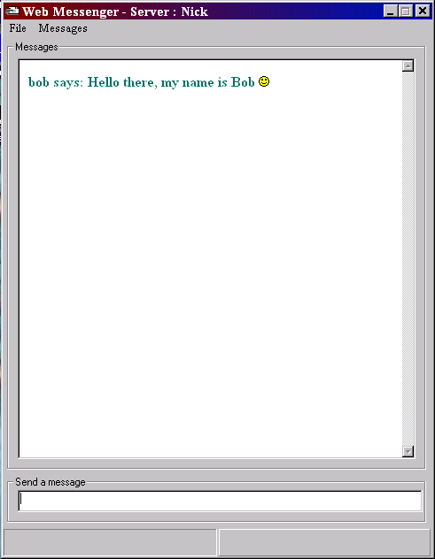



## Web Messenger

### Description

Web Messenger is a simple TCP/IP messenger application just like MSN Messenger.
 
### More Info
 

             |
---                |---
**Submitted On**   |2001-02-09 09:35:40
**By**             |[Niknak\!\! \<OLD\>](https://github.com/Planet-Source-Code/PSCIndex/blob/master/ByAuthor/niknak-old.md)
**Level**          |Advanced
**User Rating**    |3.5 (21 globes from 6 users)
**Compatibility**  |VB 6\.0
**Category**       |[Miscellaneous](https://github.com/Planet-Source-Code/PSCIndex/blob/master/ByCategory/miscellaneous__1-1.md)
**World**          |[Visual Basic](https://github.com/Planet-Source-Code/PSCIndex/blob/master/ByWorld/visual-basic.md)
**Archive File**   |[CODE\_UPLOAD14713292001\.zip](https://github.com/Planet-Source-Code/niknak-old-web-messenger__1-15111/archive/master.zip)

